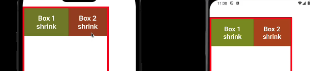

Expo: simplifies the development process
If we required native Android and IOS code, Expo allow us to eject our app and work with plain React native codebase

```
npx create-expo-app@latest HelloWorld
```

https://docs.expo.dev/

package.json: meta data, scripts and dependecies


## Core Component


1. View component (div): support layout using flexbox, styling, touch handling and accessibility contro
---

```tsx
<View style={{ flex: 1, backgroundColor: "plum" }}>
    <View style={{ width: 200, height: 200, backgroundColor: "lightblue" }}></View>
    <View style={{ width: 200, height: 200, backgroundColor: "lightgreen" }}></View>
</View>
```

2. Text Component(<p>) : supports nesting, styling and touch handling
---

```tsx
<Text>
    <Text style={{ color: "white" }}>Hello</Text> World
</Text>
```

3. Image ()
---
Helps to display various type of images such as

-   Static Images
-   Network Images
-   Images fro the local disk, such as the camera roll

```tsx
<View style={{ flex: 1, backgroundColor: "plum", padding: 60 }}>
    {/* <Image source={logoImage} style={{ width: 200, height: 200 }}></Image>
           <Image source={{uri: "https://picsum.photos/200"}} style={{ width: 300, height: 300 }}></Image> */}
    <ImageBackground source={logoImage} style={{ flex: 1 }}>
        <Text style={{ fontSize: 40, color: "blue" }}>Hello World</Text>
    </ImageBackground>
</View>
```

4. ScrollView : requireed a bouned height to function properly
---

```tsx
<View style={{ flex: 1, backgroundColor: "plum", padding: 60 }}>
    <ScrollView>
        <Image source={logoImage} style={{ width: 300, height: 400 }}></Image>
        <Text>lorem110</Text>
        <Image source={logoImage} style={{ width: 200, height: 200 }}></Image>
    </ScrollView>
</View>
```

5. Button(button tag): allow users to trigger action, it's self closing tag
---

```tsx
<Button title="Press Me" onPress={() => console.log("Button Pressed")} color={"midnightblue"} disabled />
```

6. Pressable: wrapper component that detect various types of press interactions on its defined children
---

can reate a custom button using Pressable

onPressIn : when pressed is activated
onLongPress : wen a press is held for longer than 500ms
onpressOut when press gesture deactivated


```tsx
<View style={{ flex: 1, backgroundColor: "plum", padding: 60 }}>
    <Pressable onPress={() => console.log("Image Pressed")} onLongPress={() => console.log("Long Pressed")}>
        <Image source={logoImage} style={{ width: 200, height: 200 }}></Image>
    </Pressable>
    <Pressable onPress={() => console.log("Text Pressed")}>
        <Text>Lorem ipsum dolor sit amet consectetur adipisicing elit. </Text>
    </Pressable>
</View>
```

7. Modal: screen that overrlys the app content to provide information or prompt the user for decision(only when necessary becuse they are purposefully interruption)
---

```tsx
<View style={{ flex: 1, backgroundColor: "plum", padding: 60 }}>
    <Button title="Press Me" onPress={() => setModalVisible(true)} color={"midnightblue"} />
    <Modal
        visible={isModalVisible}
        onRequestClose={() => setModalVisible(false)}
        animationType="slide"
        presentationStyle="pageSheet" //only for ios
    >
        {/* on request close is used to close the modal user presses the back button */}
        <View style={{ flex: 1, backgroundColor: "lightblue", padding: 60 }}>
            <Text>Modal content</Text>
            <Button title="Close" onPress={() => setModalVisible(false)} color={"midnightblue"} />
        </View>
    </Modal>
</View>
```

8. Status Bar: control appliction's status bar(typicall at the top of screen that display current time, wifi and network information, battery level and other status icon)
---

```ts
<StatusBar
    backgroundColor={"lightgreen"} //only work for android and can't change on ios, cant adjust text color on both platforms
    barStyle="dark-content" //dark or light text
    // hidden //to hide the status bar
/>
```

9. Activity Inidcator : circular loding indicator (used to inform user about status of ongoing process)
---

```tsx
<View>
 <ActivityIndicator/>
            <ActivityIndicator
             size="large" //small by default
             color="midnightblue"
             />
            <ActivityIndicator
             size="large" //small by default
             color="midnightblue"
             animating={false}
             />
<View>
```

10. Alert : Alert luches an alert dialog with sepcified title and message
Optinoally, we can also specify a list of buttons
---

```tsx
<View>
    <Button title="Alert 1" onPress={() => Alert.alert("Invalid data")} color={"midnightblue"} />
    <Button title="Alert 2" onPress={() => Alert.alert("Invalid data", "Date of birth is required")} color={"midnightblue"} />
    <Button
        title="Alert 3"
        onPress={() =>
            Alert.alert("Invalid data", "Date of birth is required", [
                { text: "Cancel", onPress: () => console.log("Cancel Pressed"), style: "cancel" },
                { text: "OK", onPress: () => console.log("OK Pressed") },
            ])
        }
        color={"midnightblue"}
    />
</View>
```

## Styling React Apps
React Native does not use css for styling.
You style your app using javascript

Names are written in camel case: Ex backgroundColor instead of background-color

### Styling Approach
- Inline style
- StyleSheet API
- Box-shandow: h-offset v-offset blur spread color

-   Inheritance
-   Style precedence
-   Multiple style implementation
-   Color and background color
-   Text styles
-   Box Modal
-   Border styles
-   Shadow styles
-   Elevation
-   Platform-specific styles

```tsx
export default function HomeScreen() {
    return (
        <View style={styles.container}>
            <View style={styles.darkMode}>
                {/* Styles in React Native are not inherited. For example, setting textColor: "white" on a View won't affect Text components inside it. Instead, apply the color directly to the Text component(but Text component inherit from Parent Text) */}
                <Text style={[styles.darkModeText]}>
                    Home Screen <Text style={styles.boldText}>Bold Mode</Text>
                </Text>
            </View>
            {/* last styles take precedence(eg. lightblueBg) */}
            <View style={[styles.box, styles.lightblueBg, styles.boxShadow]}>
                <Text>Lightblue box</Text>
            </View>
            <View style={[styles.box, styles.lightgreenBg, styles.androidShadow]}>
                <Text>Lightgreen box</Text>
            </View>
        </View>
    );
}

//can export to use it in other files
const styles = StyleSheet.create({
    container: {
        flex: 1,
        backgroundColor: "plum",
        padding: 60,
    },
    darkMode: {
        backgroundColor: "black",
        // color: "white"
    },
    darkModeText: {
        color: "white",
    },
    boldText: {
        fontWeight: "bold",
    },
    box: {
        width: "55%",
        height: "25%",
        // padding:10,
        paddingHorizontal: 50,
        paddingVertical: 50,
        // border property need to specify individually
        borderWidth: 2,
        borderColor: "purple",
        borderRadius: 10, //apply on both platform(ios and android) on View component but not on Text component(wokrs only on android )
    },
    lightblueBg: {
        backgroundColor: "lightblue",
    },
    lightgreenBg: {
        backgroundColor: "lightgreen",
    },
    boxShadow: {
        shadowColor: "#333333",
        shadowOffset: {
            width: 6,
            height: 6,
        },
        shadowOpacity: 0.6,
        shadowRadius: 4,
    },
    // android only support shadowColor and elevation
    androidShadow: {
        // shadowColor: "#555555",
        elevation: 20,
    },
});
```

## Layout and Flexbox
one dimensional layout model (horizonatlly or vertically), spacing, and alignment


in web


in react native


The flex property how much of a view will fill the screen along the main axis
It accepts an integer value greater than or equal to 0, indicating the fraction of the available space the component should occupy

```tsx
    <View style={styles.container}>
            {/* flex:1 means the box will take 1/4 of the available space(1/4 = 1/4) */}
            <Box style={{ backgroundColor: "lightblue", flex: 1 }}>Box1</Box>
            {/* flex:3 means the box will take 3/4 of the available space(3/4 = 0.75) */}
            <Box style={{ backgroundColor: "lightgreen", flex:3 }}>Box2</Box>
    <View>
```

## Flex direction
default: top to button
it takes: column, column-reverse, row, row-reverse
`flexDirection:row`

## Alignment
justifyContent: aligned based on main axis (like row or column)
value: flex-start, flex-end,center, space-between, space-around, space-evenly

```js
   container: {
        marginTop: 64,
        borderWidth: 6,
        borderColor:"red",
        flex:1,
        flexDirection: "row",
        justifyContent: "flex-end",
    }
```

### alignItems:
alignitems defines the default behavior for laying out flex items along the container's cross-axis Works similarly to justifyContent, but in the perpendicular direction


alignSelf


default: inhererit from parent alignitem property

```tsx
<View>
    <Box style={{ backgroundColor: "lightblue", alignSelf: "flex-start" }}>Box1</Box>
    <Box style={{ backgroundColor: "lightgreen", alignSelf: "flex-end" }}>Box2</Box>
</View>
```

### flexwrap
warp, wrap-reverse


alignContent


default value: flex-start

### gap
Gap related properties allow us to manage spacing between rows and columns

rowGap:20,
columnGap:30
gap:30(same gap for row and coumn)

### FlexBasis
The flex basis property determines the initial size of a flex item before any extra space in the container is distributed

Alternative to using the height and width properties in flex layouts


### flexShrink
flexShrink determines how children within a container
shrink along the main axis when their combined size
exceeds the container's size
The flexShrink factor is relative to other items within the
container





```tsx
export default function HomeScreen() {
    const [dimensions, setdimensions] = useState({ window: Dimensions.get("window") });
    useEffect(() => {
        const subscription = Dimensions.addEventListener("change", ({ window }) => {
            setdimensions({ window });
        });
        return () => subscription.remove();
    });
    const { window } = dimensions;
    const windowWidth = window.width;
    const windowHeight = window.height;
    return (
        <View style={styles.container}>
            <View style={[styles.box, { width: windowWidth > 500 ? "70%" : "90%", height: windowHeight > 500 ? "70%" : "90%" }]}>
                <Text style={{ fontSize: windowWidth > 500 ? 50 : 20 }}>Welocome Home BUDDDY (Wokred on both platformss) !</Text>
            </View>
        </View>
    );
}

const windowWidth = Dimensions.get("window").width;
const windowHeight = Dimensions.get("window").height;
console.log(windowWidth, windowHeight);
// Drawback of Dimensions API is values doesn't dinamically update when window dimensions change(like orientation change or screen size change(foldable phones)) . To solve this issue we can use state variable.
const styles = StyleSheet.create({
    container: {
        flex: 1,
        backgroundColor: "plum",
        alignItems: "center",
        justifyContent: "center",
    },
    box: {
        // width: windowWidth > 500 ? "70%" : "90%",
        // height: windowHeight > 500 ? "70%" : "90%",
        backgroundColor: "lightblue",
        alignItems: "center",
        justifyContent: "center",
    },
    text: {
        fontSize: windowWidth > 500 ? 50 : 20,
    },
});
```

### Recommneded use

```tsx
import { useWindowDimensions } from "react-native";
export default function HomeScreen() {
    const windowWidth = useWindowDimensions().width;
    const windowHeight = useWindowDimensions().height;
    return (
        <View style={styles.container}>
            <View style={[styles.box, { width: windowWidth > 500 ? "70%" : "90%", height: windowHeight > 500 ? "70%" : "90%" }]}>
                <Text style={{ fontSize: windowWidth > 500 ? 50 : 20 }}>Welocome Home BUDDDY (Wokred on both platformss) !</Text>
            </View>
        </View>
    );
}
```

## SafeAreaView:

In React Native, `SafeAreaView` is a component that helps ensure that the content of your application is not obscured by hardware elements such as the notch, home indicator, or status bar on devices with edge-to-edge screens. It is a built-in component that automatically applies padding to the top, bottom, or sides of your content as needed to avoid these hardware elements.

To use `SafeAreaView`, you can import it from `react-native` and wrap your content inside it. This will ensure that your UI respects the safe area boundaries of the device it's running on.

Example usage:

```tsx
import React from "react";
import { SafeAreaView, Text, StyleSheet } from "react-native";

export default function App() {
    return (
        <SafeAreaView style={styles.container}>
            <Text>Content within SafeAreaView</Text>
        </SafeAreaView>
    );
}

const styles = StyleSheet.create({
    container: {
        flex: 1,
        justifyContent: "center",
        alignItems: "center",
        backgroundColor: "plum",
    },
});
```

By using `SafeAreaView`, you provide a more consistent and visually appealing user experience across different devices by preventing important content from being hidden under the device's hardware features.


```tsx
import CustomButton from "@/components/CustomButton/CustomButton"; //there is different style on custom Button , file extention like CustomButton.iso.tsx and CustomButton.android.tsx (react native automaticaly find out )

export default function HomeScreen() {
    return (
        <SafeAreaView style={styles.safeContainer}>
            <View style={styles.container}>
                <View style={styles.box}>
                    <Text style={styles.text}>Welcome</Text>
                </View>
                <CustomButton title="Click" onPress={() => alert("Pressed")} />
            </View>
        </SafeAreaView>
    );
}

const styles = StyleSheet.create({
    safeContainer: {
        flex: 1,
        backgroundColor: "plum",
    },
    container: {
        flex: 1,
        // Platform is only appropriate for small part of coponent
        paddingTop: Platform.OS === "android" ? 25 : 0,
    },
    box: {
        padding: 20,
    },
    text: {
        // while using Platform.select for complex styles
        ...Platform.select({
            ios: {
                color: "purple",
                fontSize: 24,
                fontStyle: "italic",
            },
            android: {
                color: "blue",
                fontSize: 30,
            },
        }),
        fontWeight: "bold",
        textAlign: "center",
    },
});
```

### List


```tsx
{
    pokemonList.map((pokemon) => {
        console.log(pokemon.id); //it logs all id
        return (
            <View style={styles.card} key={pokemon.id}>
                <Text style={styles.cardText}>{pokemon.type}</Text>
                <Text style={styles.cardText}>{pokemon.name}</Text>
            </View>
        );
    });
}
```

In React Native, we use `FlatList` instead of `.map()` for rendering lists because `FlatList` is optimized for performance. It only renders items that are currently visible on the screen, which is crucial for handling large datasets efficiently. This approach improves memory usage and reduces the time to render the list, providing a smoother user experience. Additionally, `FlatList` offers built-in features such as pull-to-refresh, infinite scrolling, and item separators, which are not available when using `.map()`.

## FlatList
FlatList component renders only the items currently in view, making it highly performant for long lists
self closing props and two mandatory props data and

```tsx
<SafeAreaView style={styles.container}>
    {/* <ScrollView style={styles.scrollView}>
                {pokemonList.map((pokemon) => {
                    console.log(pokemon.id); //it prints all id of list
                    return (
                        <View style={styles.card} key={pokemon.id}>
                            <Text style={styles.cardText}>{pokemon.type}</Text>
                            <Text style={styles.cardText}>{pokemon.name}</Text>
                        </View>
                    );
                })}
            </ScrollView> */}
    <View style={styles.scrollView}>
        <FlatList
            data={pokemonList}
            renderItem={({ item }) => {
                // it doesn't print all id of list. It prints more than viewport items id to increase performance.
                // (Here it has printed around 60 id among 100)
                return (
                    <View style={styles.card} key={item.id}>
                        <Text style={styles.cardText}>{item.type}</Text>
                        <Text style={styles.cardText}>{item.name}</Text>
                    </View>
                );
            }}
            // horizontal={true}
            keyExtractor={(item) => item.id.toString()}
            ItemSeparatorComponent={() => <View style={{ height: 16, backgroundColor: "lightyellow" }} />}
            ListEmptyComponent={<Text>No items found</Text>}
            ListHeaderComponent={<Text style={styles.headerText}>Header</Text>}
            ListFooterComponent={<Text style={styles.footerText}>End of list</Text>}
        />
    </View>
</SafeAreaView>
```

### Section Head

```tsx

[
    {
      "type": "Grass",
      "data": ["Bulbasaur", "Ivysaur", "Venusaur"]
    },
    {
      "type": "Fire",
      "data": ["Charmander", "Charmeleon", "Charizard"]
    },
    {
      "type": "Water",
      "data": ["Squirtle", "Wartortle", "Blastoise"]
    },
    { "type": "Electric", "data": ["Pikachu", "Raichu"] }
  ]

<SectionList
    sections={groupPokemonList}
    renderItem={(item) => {
        return (
            <View style={styles.card}>
                <Text style={styles.cardText}>{item.item}</Text>
            </View>
        );
    }}
    // renderSectionHeader={({ section }) => {
    //     <Text style={styles.sectionHeaderText}>{section.type}</Text>
    // }}
    renderSectionHeader={({ section }) => {
        return <Text style={styles.sectionHeaderText}>{section.type}</Text>;
    }}
    ItemSeparatorComponent={() => <View style={{ height: 16, backgroundColor: "lightyellow" }} />}
/>
```


## Inputs in RN vs. Web
In web development, we have lots of HTML elements at our disposal to capture user input

For example, input fields, text areas, dropdown menus, checkboxes, radio groups, and many more

The core RN library only provides Textinput and Switch

These will be the sole focus of our learning in this section

"What about the other components?"

Expo expands our toolkit, offering additional components like checkboxes and date pickers through the Expo SDK.

## Forms in RN
Managing Form State: Controlling the dynamic data within our forms

Handling Form Validation: Ensuring the integrity and validity of the user's input

Displaying Validation Messages: Communicating the results of validation to the user

Submitting Form Data: Sending the collected information where it needs to go

Input
---

```tsx
   <SafeAreaView style={styles.container}>
     <TextInput
     value={name}
     onChangeText={setName}
     style={styles.input}
     placeholder="Enter your name"
    //  secureTextEntry
    //  keyboardType="numeric"
    //  maxLength={10}
    autoCorrect={false}
    autoCapitalize="none"
     />

     <TextInput
     style={[styles.input,styles.multilineText]}
     placeholder="message"
     multiline
     />
     <View style={styles.switchContainer}>
        <Text style={styles.text}>Dark Mode</Text>
        <Switch
        value={darkMode}
        onValueChange={setDarkMode}
        trackColor={{false: '#767577',true: '#81b0ff'}}
        thumbColor={darkMode ? '#f5dd4b' : '#f4f3f4'}
        />
     </View>
     <Text style={styles.text} >My name is {name}</Text>
    </SafeAreaView>
    multilineText:{
    minHeight:100,
    textAlignVertical: 'top' //to address to android because it is by default center
  },
```

```tsx
export default function HomeScreen() {
    const [username, setUsername] = useState("");
    const [password, setPassword] = useState("");
    const [errors, setErrors] = useState<Record<string, string>>({});
    const validateForm = () => {
        const errors = {};
        if (!username) {
            (errors as any).username = "Username is required";
        }
        if (!password) {
            (errors as any).password = "Password is required";
        }
        setErrors(errors);
        return Object.keys(errors).length === 0;
    };
    const handleSubmit = () => {
        if (validateForm()) {
            console.log("Form submitted", username, password);
            setUsername("");
            setPassword("");
            setErrors({});
        }
    };
    return (
        <SafeAreaView style={styles.container}>
            <KeyboardAvoidingView behavior="padding" keyboardVerticalOffset={Platform.OS === "ios" ? 0 : 100}>
                <Image source={require("../../assets/images/adaptive-icon.png")} style={styles.image} />
                <View style={styles.form}>
                    <Text>Username</Text>
                    <TextInput style={styles.input} placeholder="Enter your username" value={username} onChangeText={setUsername} />
                    {errors.username && <Text style={styles.error}>{errors.username}</Text>}
                    <Text>Password</Text>
                    <TextInput style={styles.input} placeholder="Enter your password" value={password} onChangeText={setPassword} secureTextEntry />
                    {errors.password && <Text style={styles.error}>{errors.password}</Text>}
                    <Button title="Login" onPress={() => handleSubmit()} />
                </View>
            </KeyboardAvoidingView>
        </SafeAreaView>
    );
}
```

## Networking

-   Fetching and submitting data to an API
-   Loading states
-   Error handling
-   FlatList component to display our data

```tsx
export default function HomeScreen() {
    const [postList, setPostList] = useState([]);
    const [isLoading, setIsLoading] = useState(true);
    const [isrefreshing, setIsRefreshing] = useState(false);
    const [postTitle, setPostTitle] = useState("");
    const [postBody, setPostBody] = useState("");
    const [isPosting, setIsPosting] = useState(false);
    const [error, setError] = useState("");

    const fetchData = async (limit = 10) => {
        try {
            // android emulator will not work with localhost, you need to use computer ip address
            const response = await fetch(`https://jsonplaceholder.typicode.com/posts?_limit=${limit}`);
            const data = await response.json();
            setPostList(data);
            setIsLoading(false);
            setError("");
        } catch (error) {
            console.log("Error fetching data:", error);
            setIsLoading(false);
            setError("Failed to fetch post list");
        }
    };
    useEffect(() => {
        fetchData();
    }, []);

    const addPost = async () => {
        setIsPosting(true);
        try {
            const response = await fetch("https://jsonplaceholder.typicode.com/posts", {
                method: "POST",
                headers: {
                    "Content-Type": "application/json",
                },
                body: JSON.stringify({
                    title: postTitle,
                    body: postBody,
                }),
            });
            const newPost = await response.json();
            setPostList([newPost, ...postList]);
            setPostTitle("");
            setPostBody("");
            setIsPosting(false);
        } catch (error) {
            console.log("Error adding post:", error);
            setIsPosting(false);
            setError("Failed to add post");
        }
    };

    const handleRefresh = () => {
        setIsRefreshing(true);
        fetchData(20);
        setIsRefreshing(false);
    };
    if (isLoading) {
        return (
            <SafeAreaView style={styles.loadingContainer}>
                <ActivityIndicator size="large" color={"#0a7ea4"} />
            </SafeAreaView>
        );
    }
    return (
        <SafeAreaView style={styles.container}>
            {error && (
                <View style={styles.errorContainer}>
                    <Text style={styles.errorText}>{error}</Text>
                </View>
            )}
            <>
                <View style={styles.inputContainer}>
                    <TextInput style={styles.input} placeholder="Post Title" value={postTitle} onChangeText={setPostTitle} />
                    <TextInput style={styles.input} placeholder="Post Body" value={postBody} onChangeText={setPostBody} />
                    <Button title={isPosting ? "Posting..." : "Add Post"} onPress={addPost} disabled={isPosting} />
                </View>
                <View style={styles.listContainer}>
                    <FlatList
                        data={postList}
                        renderItem={({ item }) => {
                            return (
                                <View style={styles.card}>
                                    <Text style={styles.nameText}>{item.title}</Text>
                                    <Text style={styles.typeText}>{item.body}</Text>
                                </View>
                            );
                        }}
                        ListEmptyComponent={<Text>No Posts Found</Text>}
                        ListHeaderComponent={<Text style={styles.headerText}>Posts</Text>}
                        ListFooterComponent={<Text style={styles.footerText}>Footer</Text>}
                        ItemSeparatorComponent={() => <View style={{ height: 16, backgroundColor: "lightyellow" }} />}
                        refreshing={isrefreshing}
                        onRefresh={() => handleRefresh()}
                    />
                </View>
            </>
        </SafeAreaView>
    );
}
```

## Navigation
The mechanism that allows users to move across different screens, access features, and generally use your app effectively
A go-to solution for handling navigation is the React Navigation library

Expo has its own built-in routing feature exclusive to Expo projects
React Navigation works both with and without Expo in React Native apps

### React Navigation
Provides a variety of navigators like Stack, Drawer, and Tab navigators

-   Stack Navigator: transitions between screens by placing each new screen on top of a stack
-   Drawer Navigator: renders a navigation drawer on the side of the screen which can be opened and closed via gestures
-   Tab Navigator: lets you easily switch between different routes at the bottom of your screen

```bash
npm install @react-navigation/native
npx expo install react-native-screens react-native-safe-area-context
```

### Stack Navigation
Each new screen is stacked on top of the previous one like a deck of cards
When you navigate to a new screen, a new card is placed on top of the stack, and
when you navigate back, the top card is removed, revealing the previous screen
Allows users to drill down into detailed views and then retrace their steps when
done
It's particularly useful in scenarios where a linear flow of screens is required
List View to Details View to More Details View

## Two navigators: Stack Navigator and Native Stack Navigator

The Stack Navigator is a JavaScript-based navigator which offers a high degree of customization, making it a great choice for apps that require a unique navigation
experience
However, this comes at the cost of performance especially when compared to its counterpart, the Native Stack Navigator
The Native Stack Navigator leverages the native navigation constructs of iOS and Android, providing better performance and a more native feel to the transitions and gestures
The caveat here is, it might not offer the same level of customization as the Stack Navigator

# 📌 **React Navigation in an Expo Project**

React Navigation is the most popular way to handle navigation in React Native apps. It provides **stack navigation, bottom tab navigation, and drawer navigation**, allowing for smooth transitions between screens.

This note covers **installation, setup, navigation methods, passing parameters, updating headers dynamically, handling authentication, deep linking, and best practices.**

---

## 1️⃣ **Installation**

Before using React Navigation, install the required dependencies in an **Expo** project:

```sh
npx expo install @react-navigation/native react-native-screens react-native-safe-area-context react-native-gesture-handler react-native-reanimated react-native-vector-icons
```

Then, install specific navigators based on your needs:

```sh
npm install @react-navigation/native-stack  # Stack Navigation
npm install @react-navigation/bottom-tabs   # Bottom Tab Navigation
npm install @react-navigation/drawer        # Drawer Navigation
```

---

## 2️⃣ **Navigation Container**

The **NavigationContainer** component should wrap your entire app. It acts as the navigation manager, handling navigation state and linking configuration.

```js
import { NavigationContainer } from "@react-navigation/native";

export default function App() {
    return <NavigationContainer>{/* Add navigation stacks here */}</NavigationContainer>;
}
```

---

## 3️⃣ **Stack Navigation (Push & Pop Screens Like a Stack)**

### 🔹 What is Stack Navigation?

Stack navigation mimics the behavior of a **call stack**, where screens are pushed onto the stack and popped off when navigating back.

### 🔹 When to Use Stack Navigation?

-   Apps with hierarchical navigation (e.g., opening a details page from a home screen).
-   Apps where users need a **back button** to return to the previous screen.

### 🔹 How to Implement Stack Navigation?

#### **Installation**

```sh
npm install @react-navigation/native-stack
```

#### **Usage**

```js
import { createNativeStackNavigator } from "@react-navigation/native-stack";
import HomeScreen from "@/screens/HomeScreen";
import AboutScreen from "@/screens/AboutScreen";

const Stack = createNativeStackNavigator();

const AboutStack = () => {
    return (
        <Stack.Navigator
            initialRouteName="Home"
            screenOptions={{
                title: "Welcome Home",
                headerStyle: { backgroundColor: "#6a51ae" },
                headerTintColor: "#fff",
                headerTitleStyle: { fontWeight: "bold" },
                headerRight: () => (
                    <Pressable onPress={() => alert("Menu button pressed")}>
                        <Text style={{ color: "#fff", fontSize: 16 }}>Menu</Text>
                    </Pressable>
                ),
                contentStyle: { backgroundColor: "#e8e4f3" },
            }}
        >
            <Stack.Screen name="Home" component={HomeScreen} />
            <Stack.Screen
                name="About"
                component={AboutScreen}
                initialParams={{ name: "Guest" }}
                options={({ route }) => ({ title: `About ${route.params.name}` })}
            />
        </Stack.Navigator>
    );
};

export default AboutStack;
```

### 🔹 Key Features in Stack Navigation:

✅ **Initial Route**: The first screen when the app starts (`initialRouteName`).  
✅ **Header Customization**: Change title, background, font styles, and add buttons.  
✅ **Passing Parameters**: Pass data from one screen to another (`initialParams`).

---

## 4️⃣ **Bottom Tab Navigation (Tab-Based Navigation)**

### 🔹 What is Tab Navigation?

Tab navigation is used when you want a **bottom navigation bar** similar to **Instagram** or **Twitter**.

### 🔹 When to Use Tab Navigation?

-   When users frequently switch between different sections of an app.
-   When each tab represents a self-contained feature (e.g., **Profile, Home, Settings**).

### 🔹 How to Implement Tab Navigation?

#### **Installation**

```sh
npm install @react-navigation/bottom-tabs
```

#### **Usage**

```js
import { createBottomTabNavigator } from "@react-navigation/bottom-tabs";
import { Ionicons } from "@expo/vector-icons";
import ProfileScreen from "@/screens/ProfileScreen";
import SettingsScreen from "@/screens/SettingsScreen";
import { AboutStack } from "./AppStack";

const Tab = createBottomTabNavigator();

export default function App() {
    return (
        <Tab.Navigator
            screenOptions={{
                tabBarLabelPosition: "beside-icon",
                tabBarShowLabel: true,
                tabBarActiveTintColor: "purple",
                tabBarInactiveTintColor: "green",
            }}
        >
            <Tab.Screen
                name="Profile"
                component={ProfileScreen}
                options={{
                    tabBarLabel: "My Profile",
                    tabBarIcon: ({ color }) => <Ionicons name="person" size={24} color={color} />,
                    tabBarBadge: 3,
                    tabBarBadgeStyle: { backgroundColor: "blue" },
                }}
            />
            <Tab.Screen name="Settings" component={SettingsScreen} />
            <Tab.Screen name="About Stack" component={AboutStack} options={{ headerShown: false }} />
        </Tab.Navigator>
    );
}
```

### 🔹 Key Features in Tab Navigation:

✅ **Custom Icons**: Add icons using **Ionicons** or other icon libraries.  
✅ **Badges**: Show unread notifications with `tabBarBadge`.  
✅ **Label Positioning**: Adjust label placement beside or below the icon.

---

## 5️⃣ **Drawer Navigation (Sidebar Navigation for Large Apps)**

### 🔹 What is Drawer Navigation?

Drawer navigation provides a **hamburger menu** that slides out from the side.

### 🔹 When to Use Drawer Navigation?

-   When you have **many top-level screens**.
-   When using a **sidebar menu** like **Gmail**.

### 🔹 How to Implement Drawer Navigation?

#### **Installation**

```sh
npm install @react-navigation/drawer
```

#### **Usage**

```js
import { createDrawerNavigator } from "@react-navigation/drawer";
import DashboardScreen from "@/screens/DashboardScreen";
import SettingsScreen from "@/screens/SettingsScreen";

const Drawer = createDrawerNavigator();

export default function App() {
    return (
        <Drawer.Navigator initialRouteName="Dashboard">
            <Drawer.Screen
                name="Dashboard"
                component={DashboardScreen}
                options={{
                    title: "My Dashboard",
                    drawerLabel: "Dashboard",
                    drawerActiveTintColor: "#333",
                    drawerActiveBackgroundColor: "lightblue",
                    drawerContentStyle: { backgroundColor: "#c6cbef" },
                }}
            />
            <Drawer.Screen name="Settings" component={SettingsScreen} />
        </Drawer.Navigator>
    );
}
```

### 🔹 Key Features in Drawer Navigation:

✅ **Custom Drawer Styles**: Change **background, active tint, and labels**.  
✅ **Hidden by Default**: Drawer appears when user swipes from the edge or taps the menu button.

---

## 6️⃣ **Passing Data Between Screens**

### 🔹 Passing Parameters:

```js
navigation.navigate("About", { name: "Shankalpa" });
```

### 🔹 Receiving Parameters:

```js
const { name } = route.params;
<Text>About {name}</Text>;
```

### 🔹 Updating Parameters Dynamically:

```js
<Button title="Update Name" onPress={() => navigation.setParams({ name: "New Name" })} />
```

---

## 7️⃣ **Returning Data to Previous Screen**

### 🔹 Passing Data Back:

```js
<Button
    title="Go back with data"
    onPress={() => {
        navigation.navigate("Home", { result: "Data from About" });
    }}
/>
```

### 🔹 Receiving Data:

```js
<Text>Result: {route.params?.result}</Text>
```

---

## 8️⃣ **Updating Screen Header Dynamically**

### 🔹 Using `useLayoutEffect` for Instant Updates:

```js
import { useLayoutEffect } from "react";

export default function AboutScreen({ navigation, route }) {
    const { name } = route.params;

    useLayoutEffect(() => {
        navigation.setOptions({ title: name });
    }, [navigation, name]);
}
```

### 🔹 Why `useLayoutEffect` Instead of `useEffect`?

✅ Runs **before** the screen renders (no delay).  
✅ Makes UI changes smoother.

---

```bash
(base) apple~$npx expo start --ios
Starting project at /Users/shankalpapokharel/Desktop/ReactNative/HelloWorld
Starting Metro Bundler
Unable to run simctl:
Error: xcrun simctl help exited with non-zero code: 72
✔ Xcode must be fully installed before you can continue. Continue to the App Store? … yes
Going to the App Store, re-run Expo CLI when Xcode has finished installing.
(base) apple~$
```

The error message indicates that Xcode is not fully installed or properly configured, which is required to run the iOS simulator for your Expo project. Here's how you can resolve the issue:

### Steps to Fix the Issue

1. **Install Xcode Fully**

    - If Xcode is not installed, follow the prompt to install it via the App Store.
    - Ensure that the installation is complete and includes all necessary components like Command Line Tools.

2. **Set Xcode Path**

    - Run the following command in your terminal to set the correct path for Xcode:
        ```bash
        sudo xcode-select -s /Applications/Xcode.app/Contents/Developer
        ```
        This ensures that your system uses the correct version of Xcode[2].

3. **Verify Installation**

    - Open Xcode and check if all components are installed (Preferences > Locations > Command Line Tools).
    - Run `xcrun simctl list devices` in your terminal to confirm that the simulator devices are listed correctly[8].

4. **Update Expo CLI**

    - Ensure you have the latest version of Expo CLI by running:
        ```bash
        npm install -g expo-cli
        ```

5. **Run Simulator**

    - Start your project using:
        ```bash
        npx expo start --ios
        ```
    - Ensure that the iOS simulator is open before running this command[4].

6. **Debugging Tips**
    - If issues persist, try resetting simulators using:
        ```bash
        fastlane snapshot reset_simulators
        ```
    - Clear Derived Data in Xcode (Preferences > Locations > Derived Data)[4].

### Additional Notes

-   If you are still redirected to the App Store despite having Xcode installed, it could be a configuration issue with Expo CLI or missing dependencies. Double-check your setup and ensure all required tools are properly installed[6].
-   For advanced debugging, you can generate native code for iOS using `npx expo prebuild -p ios` and debug directly in Xcode[7].

# Why Expo Router?

-   most challenging was aspects was often navigation

-   Traditionally, relied on libraries like React Navigation, which require manual configuration of - navigators, screens, and routes

-   This can quickly become complex and difficult to maintain as your application grows

-   Expo Router simplifies this entire process by using a file-based approach The structure of your files and folders directly determines the navigation structure of your app
-   Expo Router apps are cached and run offline-first, with automatic updates when you publish a new version

-   Your app can handle incoming native URLs without requiring a network connection or server.

-   Expo Router is built on top of React Navigation

-   It's not a complete replacement but rather an enhancement that make much more intuitive and easier to manage.

## Expo Router vs React Navigation
Simplicity
With React Navigation, you need to manually define and configure each navigator, screen, and route. This involves writing a lot of boilerplate code.

Expo Router eliminates this by automatically generating routes based on your file structure.

### Maintainability

As your app grows, managing navigation with React Navigation can become increasingly complex.
With Expo Router, the file system serves as a visual representation of your app's navigation structure, making it much easier to understand and maintain.

### Deep linking
Expo Router automatically enables deep linking for every screen in your app.
This means any route can be accessed directly via a URL, which is essential for features like push notifications, sharing links, and web integration.

### Universal platform support
Expo Router works seamlessly across Android, iOS, and web, using the same navigation structure.
This is particularly valuable if you're building a cross-platform applicat

### Type safety
Expo Router can automatically type your routes, ensuring you can only link to valid routes and preventing errors from linking to routes that don't exist.

### Optimization
Routes are automatically optimized with lazy-evaluation in production and deferred bundling in development.
This means your app loads faster and uses resources more efficiently.

### Discoverability
Expo Router enables build-time static rendering on web and universal linking to native.
This means your app content can be indexed by search engines, making it truly discoverable - a feature that's typically only available to web applications.

### File-based routing
Expo Router is a file-system based routing system, meaning the routes you can access in your app are determined by how you organize your files and folders in your code
"Does every file in our app become a route?"

Expo Router is built around conventions.

File-based routing conventions

1. All routes must live inside the app folder
2. Any file that defaults exports a React component becomes a route
3. Each folder represents a segment of the URL path
4. Index files (index.js or index.tsx) represent the root of that segment

When these conventions are followed, the file automatically becomes available as a route in your application
Files in the app folder that uniquely represent a route are called pages

## Dynamic routes


Dynamic routes allow us to create parameterized paths that can handle a wide variety of content with just a single route definition

We can create dynamic route segments by using square brackets in our file or folder names
For ex: [param].tsx or [param]/index.tsx
The text inside the brackets becomes a parameter that we can access in our component

`<Link href="/products">Products</Link>`


### Layouts
Pages are route-specific Ul components

Layouts are Ul components that wrap around your pages, allowing you to share common elements across multiple routes
Think of headers, footers, navigation bars, or any Ul element that should remain consistent as users navigate through your app

To create a layout, default export a React component from an \_layout.js or \_layout.tsx file

The layout component renders a Slot component from Expo Router, which will be populated with your page content


### Route groups
Route Groups is a feature of Expo Router that allows you to logically organize your routes without impacting the URL structure

1. You want to group related routes together
2. You need to share layouts between specific routes
3. You want to create multiple root layouts in your app

```ts
if (!isLoggedIn) {
    return <Redirect href="/login" />;
}
```

```tsx
<>
    <Link href="/products/best-sellers/playstation" asChild>
        <Pressable style={styles.button}>
            <Text>Playstation</Text>
        </Pressable>
    </Link>
    <Button title="Login" onPress={() => router.replace("/profile")} />
</>
```

## Stack navigation
Think of Stack Navigation like a deck of cards
Each new screen you navigate to is like placing a new card on top of the stack
When you go back, you're removing the top card to reveal what's underneath
For example, when you're browsing a list of products, tap on one to see details, and then tap on a related product to see more details
Expo Router makes implementing Stack Navigation super easy with its built-in Stack component

```tsx
import { Stack } from "expo-router";
import { Image, Pressable, Text } from "react-native";

function LogoTitle() {
    return <Image style={{ width: 30, height: 30 }} source={{ uri: "https://reactnative.dev/img/tiny_logo.png" }} />;
}

export default function RootLayout() {
    return (
        <Stack
            screenOptions={{
                headerStyle: { backgroundColor: "#6a51ae" },
                headerTintColor: "#fff",
                headerTitleStyle: { fontWeight: "bold" },
                headerRight: () => (
                    <Pressable onPress={() => alert("Menu button pressed!")}>
                        <Text style={{ color: "#fff", fontSize: 16 }}>Menu</Text>
                    </Pressable>
                ),
                headerTitle: (props) => <LogoTitle />,
            }}
        >
            <Stack.Screen name="index" options={{ title: "Home" }} />
            <Stack.Screen name="about" options={{ title: "about" }} />
        </Stack>
    );
}
```

## Tab navigation
Tab Navigation offers a way to switch between different screens by tapping on a tab which is usually displayed at the bottom of the screen
If you were to open Reddit, Instagram, Spotify or Twitter on your phone right now, you would see a tab bar with several tabs along the bottom of the screen


`app/_layout.tsx`
```tsx
import { Stack } from "expo-router";
import { StatusBar } from "expo-status-bar";

export default function RootLayout() {
  return (
    <>
    <StatusBar/>
    <Stack >
    <Stack.Screen name="(tabs)" options={{ headerShown: false }} />
    </Stack>
    </>
  )
}
```
`app/(tabs)/_layout.tsx`
```tsx
import { Tabs } from "expo-router";
import FontAwesome from '@expo/vector-icons/FontAwesome';

export default function TabLayout() {
    return <Tabs
    screenOptions={{
        tabBarLabelPosition: 'beside-icon',
        tabBarShowLabel: true,
        headerTitle: 'Recipe App',
        tabBarActiveTintColor: "#22d3ee",
        tabBarInactiveTintColor: "#94a3b8",
        tabBarStyle: {
          backgroundColor: "#0f172a",
        },
        headerStyle: {
          backgroundColor: "#0f172a",
        },
        headerTintColor: "#f8fafc",
    }}
    >
        <Tabs.Screen 
            name="index" 
            options={{ 
                title: 'Home',
                tabBarLabel: 'Home', 
                tabBarIcon: ({ color, size }) => (
                    <FontAwesome name="home" color={color} size={size} />
                ),
            }} 
        />
        <Tabs.Screen 
            name="explore" 
            options={{ 
                title: 'Explore',
                tabBarLabel: 'Explore', 
                tabBarIcon: ({ color, size }) => (
                    <FontAwesome name="search" color={color} size={size} />
                ),
            }} 
        />
        <Tabs.Screen 
            name="profile" 
            options={{ 
                title: 'My Profile',
                tabBarLabel: 'My Profile', 
                tabBarIcon: ({ color, size }) => (
                    <FontAwesome name="user" color={color} size={size} />
                ),
                tabBarBadge: 3
            }} 
        />
    </Tabs>;
}
```

## Drawer navigation
If you've used apps like Gmail or Spotify, you're already familiar with this pattern
It's that menu that slides in from the side when you tap the hamburger icon or swipe from the edge of the screen
```bash
npx expo install @react-navigation/drawer react-native-gesture-handler react-native-reanimated
```

```tsx
import { Stack } from "expo-router";
import { Drawer } from "expo-router/drawer";
import { StatusBar } from "expo-status-bar";
import React from "react";
import { GestureHandlerRootView } from "react-native-gesture-handler";
import { FontAwesome } from "@expo/vector-icons";

export default function RootLayout() {
    return (
        <GestureHandlerRootView style={{ flex: 1 }}>
            <StatusBar backgroundColor="#0f172a" />
            <Drawer 
             screenOptions={{
              headerTitle: 'Recipe App',
              drawerActiveTintColor: "#22d3ee",
              drawerInactiveTintColor: "#94a3b8",
              drawerStyle: {
                backgroundColor: "#0f172a",
              },
              headerStyle: {
                backgroundColor: "#0f172a",
              },
              headerTintColor: "#f8fafc",
          }}
            >
                <Drawer.Screen
                    name="index"
                    options={{
                        title: "Home title",
                        drawerLabel: "Home Label",
                        drawerIcon: ({ color }) => <FontAwesome name="home" size={24} color={color} />,
                    }}
                />
                <Drawer.Screen
                    name="dashboard"
                    options={{
                        title: "Dashboard",
                        drawerLabel: "Dashboard",
                        drawerIcon: ({ color }) => <FontAwesome name="dashboard" size={24} color={color} />,
                    }}
                />
                <Drawer.Screen
                    name="setting"
                    options={{
                        title: "Settings",
                        drawerLabel: "Settings",
                        drawerIcon: ({ color }) => <FontAwesome name="cog" size={24} color={color} />,
                    }}
                />
            </Drawer>
        </GestureHandlerRootView>
    );
}
```

## Modal
A Modal is a screen that overlays the app content to provide important information or prompt the user for a decision
You can create modals in one of two ways:
- Using the 'Modal component from React Native
- Using Expo Router's file-based syntax


```tsx
import { Stack } from "expo-router";

export default function RootLayout() {
  return (
    <Stack>
      <Stack.Screen name="index" options={{ title: "Home" }} />
      <Stack.Screen
        name="modal"
        options={{ title: "Modal", headerShown: false, presentation: "modal" }}
      />
      <Stack.Screen
        name="webmodal"
        options={{
          presentation: "transparentModal",
          animation: "fade",
          headerShown: false,
        }}
      />
    </Stack>
  );
}
```


git commit -m "first commit"
git branch -M main
git remote add origin git@github.com:ShankalpaPokharel/ReactNative.git
git push -u origin main